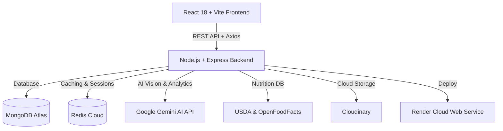

<div align="center">

  <!-- ========================================== -->
  <!-- 🎨 HERO APP BANNER PLACEHOLDER            -->
  <!-- ========================================== -->
  <!-- Replace YOUR_HERO_BANNER_IMAGE_URL with your banner link -->
  

  # 🌿 NutriVedic
  ### **AI-Powered Holistic Indian Nutrition & Smart Kitchen Management Platform**

  <p align="center">
    <strong>Team:</strong> <code>Code Invaders</code> &nbsp;|&nbsp;
    <strong>Live Backend API:</strong> <a href="https://nutrivedic-backend.onrender.com/api/health"><code>nutrivedic-backend.onrender.com</code></a> &nbsp;|&nbsp;
    <strong>GitHub Repo:</strong> <a href="https://github.com/Sushant-Ravi14/NutriVedic"><code>Sushant-Ravi14/NutriVedic</code></a>
  </p>

  <p align="center">
    <a href="https://nutrivedic-backend.onrender.com/api/health"></a>
    <a href="https://documenter.getpostman.com/view/50840877/2sBY4WmveL"></a>
    <a href="https://github.com/Sushant-Ravi14/NutriVedic"></a>
    
    
    
    
  </p>

</div>

---

## 📌 Application Showcase & Visual Placeholders

<!-- Placeholders for high quality app preview screenshots -->
<div align="center">
  <table>
    <tr>
      <td width="50%" align="center">
        <b>📱 Dashboard & Daily Macro Tracking</b><br/><br/>
        <!-- Replace YOUR_DASHBOARD_IMAGE_URL with your image link -->
        
      </td>
      <td width="50%" align="center">
        <b>📸 AI Vision Scanner & Freshness Detector</b><br/><br/>
        <!-- Replace YOUR_SCANNER_IMAGE_URL with your image link -->
        
      </td>
    </tr>
    <tr>
      <td width="50%" align="center">
        <br/><b>🥗 Personalised Ayurvedic Diet Plan</b><br/><br/>
        <!-- Replace YOUR_DIETPLAN_IMAGE_URL with your image link -->
        
      </td>
      <td width="50%" align="center">
        <br/><b>⚡ 4-Step Personalized Onboarding</b><br/><br/>
        <!-- Replace YOUR_ONBOARDING_IMAGE_URL with your image link -->
        
      </td>
    </tr>
  </table>
</div>

---

## 🌟 Unique Selling Proposition (USP)

### 💎 Premium Plan ($9 / month) — Instant AI Chef Assistant
> **Minimum Preparation Time • Maximum Health • Personalized Craving Satisfaction**

NutriVedic’s flagship Premium AI Assistant is built for busy individuals who want to eat healthy without spending hours in the kitchen.

- ⏱️ **Minimal Preparation Time**: Specify your available prep time (e.g., *10 mins, 15 mins*), and the AI formulates meals designed for speed.
- 🥘 **Craving-Matched Healthy Recipes**: Craving something spicy, comforting, or sweet? Tell the AI what you want to eat, and it converts your craving into a therapeutic, nutrient-dense recipe aligned with your Ayurvedic profile (Dosha) and health goals (e.g. Type-2 Diabetes, PCOS).
- 🥑 **Zero-Waste Pantry Integration**: Automatically prioritizes ingredients currently expiring in your fridge to save money and prevent food waste.

---

## ⚔️ Why NutriVedic? (Competitive Matrix)

Most traditional nutrition apps focus strictly on basic calorie counting with generic global databases. **NutriVedic bridges ancient Ayurvedic principles with state-of-the-art Multimodal AI.**

| Feature | NutriVedic 🌿 | MyFitnessPal / Yazio ❌ | HealthifyMe ⚠️ |
| :--- | :---: | :---: | :---: |
| **Ayurvedic Dosha & Therapeutic Targeting** | ✅ Yes (Pitta/Kapha/Vata) | ❌ No | ❌ No |
| **Gemini Vision AI Food Recognition** | ✅ Instant Visual Scan | ⚠️ Paid / Text-based | ⚠️ Partial |
| **Produce Freshness & Decay AI Detection** | ✅ Yes (Shelf life estimation) | ❌ No | ❌ No |
| **$9 AI Chef (Min. Prep Time Recipes)** | ✅ Yes | ❌ No | ❌ No |
| **Indian Food & Cuisine Precision** | ✅ Tailored for Indian Diets | ⚠️ Limited | ✅ Yes |
| **Automated Expiration & Fridge Inventory** | ✅ Built-in Waste Alerter | ❌ No | ❌ No |
| **Offline Sync Queue (PWA Ready)** | ✅ Yes | ❌ Requires Connection | ❌ Requires Connection |

---

## 🚀 Core Features

- 📸 **AI Multimodal Scanner**: Snap a picture of any meal or produce item. Google Gemini Vision identifies ingredients, exact macros, and freshness levels instantly.
- 🩺 **Therapeutic Condition Alignment**: Tailors meals for conditions such as *Type 2 Diabetes, PCOS/PCOD, Hypertension, Thyroid, and Fatty Liver*.
- 📊 **TDEE & Caloric Target Calculation**: Scientific calculation based on Harris-Benedict & Katch-McArdle formulas adapted to user activity patterns.
- 📦 **Barcode & USDA Integration**: Scans packaged goods using OpenFoodFacts and USDA FoodData Central.
- 🔔 **Smart Kitchen Inventory Alerter**: Automated background cron jobs notify users before produce expires.

---

## 🛠️ Technology Stack



- **Frontend**: React 18, Vite, Framer Motion, Vanilla CSS Design System, Zustand, Lucide React
- **Backend**: Node.js, Express.js, Mongoose, Passport.js (Google OAuth 2.0), JWT Auth
- **AI & Integrations**: Google Gemini 1.5/2.0 Flash, USDA FoodData Central, OpenFoodFacts API, Razorpay Payment Gateway, Sentry Error Tracking

---

## ⚡ Quick Start & Setup

### 1. Clone the Repository
```bash
git clone https://github.com/Sushant-Ravi14/NutriVedic.git
cd NutriVedic
```

### 2. Backend Setup
```bash
cd backend
npm install
```
Create a `.env` file in `backend/` based on `.env.example` and set your credentials. Then start the server:
```bash
npm run dev
```

### 3. Frontend Setup
```bash
cd ../frontend
npm install
npm run dev
```
Open `http://localhost:5173` in your browser.

---

## 📡 Live API Endpoints & Postman Documentation

- 🌐 **Live Deployed Backend**: 👉 **`https://nutrivedic-backend.onrender.com`**
- 📚 **Interactive Postman Web Documentation**: 👉 **[NutriVedic Live Postman Docs](https://documenter.getpostman.com/view/50840877/2sBY4WmveL)**
- 📄 **Importable Postman Collection**: **[`backend/NutriVedic.postman_collection.json`](file:///c:/Users/Swaraj/OneDrive/Desktop/NutriVedic/NutriVedic/backend/NutriVedic.postman_collection.json)**

---

## 👥 Team Members & Roles — Code Invaders

<div align="center">

| Member Name | Role | Core Focus & Responsibilities | GitHub Profile |
| :--- | :--- | :--- | :---: |
| **Swaraj Prajapati** | 👑 **Team Leader** | Backend Architecture, API Development, Database Schemas, Gemini AI Integration & Cloud Deployment | [@SwarajPrajapati2006](https://github.com/SwarajPrajapati2006) |
| **Sushant Ravi** | 🎨 **Team Member** | Frontend UI/UX Design, React Component Library, Framer Motion Animations & User Flows | [@Sushant-Ravi14](https://github.com/Sushant-Ravi14) |

</div>

---

## 🖼️ How to Add High-Quality App Images to this README

To make your GitHub repository look ultra-premium:

1. **Capture High-Res Screenshots**:
   - Open your browser, press `F12` ➔ Device Toolbar ➔ Choose `MacBook Air` or `1080p Desktop`.
   - Take full-resolution screenshots (or use tools like **CleanShot X** or **Shotdeck**).
2. **Add Device Framing (Optional)**:
   - Drag your screenshots into **Figma** or free tools like **MockupBro** / **Scribe** to add a subtle shadow or browser frame.
3. **Upload to GitHub (Free Image Hosting)**:
   - Go to your repository on GitHub (`Sushant-Ravi14/NutriVedic`).
   - Click **Issues** ➔ **New Issue** (or Releases).
   - Drag & drop your image into the text box. GitHub will generate a permanent CDN URL like:
     `https://user-images.githubusercontent.com/.../screenshot.png`
4. **Paste the URLs into `README.md`**:
   - Replace `YOUR_HERO_BANNER_IMAGE_URL`, `YOUR_DASHBOARD_IMAGE_URL`, `YOUR_SCANNER_IMAGE_URL`, `YOUR_DIETPLAN_IMAGE_URL`, and `YOUR_ONBOARDING_IMAGE_URL` with your generated GitHub CDN URLs!

---

<div align="center">
  <sub>Built with ❤️ by <b>Team Code Invaders</b> for NutriVedic • 2026</sub>
</div>